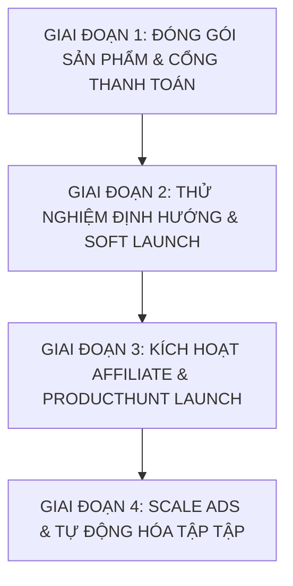

# AIO STUDIO — BẢN TỔNG HỢP TOÀN DIỆN CHIẾN LƯỢC SẢN PHẨM (MVP), BẢNG GIÁ, MARKETING & LỘ TRÌNH THỰC THI (MASTER STRATEGY & PIPELINE)

> **Tài liệu hợp nhất Master — Tổng hợp đầy đủ từ tất cả các file kế hoạch:**
> `BANG_GIA_CAO_CAP_PREMIUM.md` • `BAO_CAO_TONG_HOP_MARKETING_VA_BANG_GIA.md` • `PIPELINE.md` • `STRATEGY_TUVAN_CMO_20NAM.md` • `Yêu cầu.txt`
> **Dành riêng cho Founder Anh Tiến & Đội ngũ Phát triển** — **Ngày lập:** 2026-08-07

---

## 📌 PHẦN I: TỔNG QUAN HỆ SINH THÁI & ĐỊNH VỊ MVP (PRODUCT & ECOSYSTEM ALIGNMENT)

### 1. Triết Lý Sản Phẩm Cốt Lõi (From 5-Year Pro Editor Experience)
Sản phẩm **AiO Studio (All-in-One Studio)** được kết tinh từ **5 năm kinh nghiệm thực chiến dựng phim** của Founder Anh Tiến, tích lũy qua hàng ngàn giờ làm việc thực tế, giải quyết chính xác từng vết sẹo và nỗi đau mà các Editor & Agency gặp phải.

- **Đa Nền Tảng (Cross-OS & Multi-NLE):** Chạy native mượt mà trên **Windows & macOS**, hỗ trợ 2 phần mềm dựng phim hàng đầu thế giới **Adobe Premiere Pro & DaVinci Resolve**.
- **100% Offline & Bảo Mật Tuyệt Đối:** Thuật toán AI xử lý hoàn toàn trên phần cứng máy local của Editor, không upload video lên Cloud Server, bảo mật tuyệt đối dự án của khách hàng.
- **Không Giới Hạn Quota (Unlimited Local Processing):** Không tính phí theo số phút audio/video hay dung lượng dự án. Editor thoải mái xử lý 100 hay 1.000 giờ video mỗi tháng.
- **Kiến Trúc Mở Rộng Mô-Đun (Expandable Suite):** Không chỉ là 7–8 công cụ ban đầu, AiO Studio là một platform mở rộng chứa hàng chục công cụ chuyên biệt (Cắt khoảng lặng, Podcast Multicam, Re-Frames, Transcripts, BGM Music, Asset Manager, Power Bins, Guideline Frame, Color Match...).
- **Tối Ưu Siêu Nhẹ ("Nhẹ để nhanh, không nặng để đẹp"):** Thiết kế chuẩn **Studio Console** (`#181818` dark theme), phản hồi 150ms, tiết kiệm CPU/RAM cho máy dựng.

---

## 🔍 PHẦN II: MA TRẬN SO SÁNH ĐỐI THỦ THỊ TRƯỜNG QUỐC TẾ (GLOBAL COMPETITOR MATRIX)

Thị trường công cụ dựng video quốc tế chia làm 2 nhóm:
1. **Web-Based SaaS Apps (Submagic, OpusClip, CapCut Web):** Quảng cáo rầm rộ nhưng bắt buộc người dùng phải export và upload video hàng Gigabyte lên Web, thu phí đắt đỏ theo số phút, làm gãy hoàn toàn workflow của Editor chuyên nghiệp.
2. **Plugins Rời (AutoPod, AutoCut.fr, FireCut AI):** Chạy trong Premiere nhưng bán lẻ từng plugin, thu phí duy trì hàng tháng cao, dễ bị lệch tiếng/hình ở video dài.

### Bảng So Sánh Trực Diện:

| Tiêu chí | Web SaaS (Submagic, OpusClip) | Plugins Rời (AutoPod, AutoCut.fr) | **AiO Studio Master Suite** |
| :--- | :--- | :--- | :--- |
| **Môi Trường Hoạt Động** | Trình duyệt Web | Native Plugin | **Native trong Premiere Pro & DaVinci Resolve** |
| **Hệ Điều Hành** | macOS, Win (Web) | Tùy plugin | **Windows & macOS (100% Native)** |
| **Bảo Mật Dữ Liệu** | Phải Upload video lên Web Server | Cần Cloud Server | **100% OFFLINE trên máy Local** |
| **Giới Hạn Số Phút** | Giới hạn credits / phút hàng tháng | Phụ thuộc server | **UNLIMITED (Không giới hạn)** |
| **Xử Lý Tập Dài >90m** | Dễ rớt mạng, tốn thời gian upload | Dễ trôi lip-sync tiếng/hình | **Chống trôi lip-sync tuyệt đối (>90m)** |
| **Cập Nhật Tính Năng** | Chậm / Theo quý | Hiếm khi cập nhật | **CẬP NHẬT TRỰC TIẾP HÀNG NGÀY / HÀNG THÁNG** |
| **Quy Mô Bộ Tool** | 1 web app đơn lẻ | 1 - 3 tools | **Hệ sinh thái mở rộng HÀNG CHỤC Tools** |

---

## 💵 PHẦN III: MÔ HÌNH HỢP TÁC WIN-WIN & ĐỊNH GIÁ THUÊ BAO BỀN VỮNG

### 1. Triết Lý Trao Đổi Win-Win:
> *"Người dùng bỏ chi phí thuê bao hợp lý (Tháng/Năm) ➔ Founder & Đội ngũ sản xuất nâng cấp tính năng mới & tối ưu thuật toán AI trực tiếp HÀNG NGÀY & HÀNG THÁNG ➔ Khách hàng luôn được sử dụng những công cụ dựng phim mạnh mẽ nhất, còn đội ngũ phát triển có dòng tiền ổn định để cống hiến lâu dài."*

### 2. Cấu Trúc Bảng Giá Khuyên Dùng (USD Only - Global Market):

```
┌────────────────────────────────────────────────────────────────────────────────────────┐
│                        WIN-WIN SUSTAINABLE PRICING MATRIX                              │
├──────────────────────────────┬──────────────────────────┬──────────────────────────────┤
│ 🌟 STARTER MONTHLY           │ 🚀 ANNUAL PRO PASS       │ 👑 ENTERPRISE / AGENCY PASS  │
│    (Gói Theo Tháng)          │    (TIẾT KIỆM 60% - BEST) │    (GÓI ĐỘI NGŨ / AGENCY)    │
├──────────────────────────────┼──────────────────────────┼──────────────────────────────┤
│  $14.90 – $29.00 / tháng     │  $69 – $149 / năm        │  Liên hệ / Custom Key        │
│                              │  (~ $5.75 - $12.40/tháng)│                              │
├──────────────────────────────┼──────────────────────────┼──────────────────────────────┤
│ • Full Hệ sinh thái Tools    │ • Full Hệ sinh thái Tools│ • Full 8+ Tools cho Multi-Users│
│ • Win & macOS Native         │ • Win & macOS Native     │ • Win & macOS Native         │
│ • Premiere & DaVinci Resolve │ • Premiere & DaVinci     │ • VIP Support 1-on-1 Dedicated│
│ • Hủy bất kỳ lúc nào         │ • CẬP NHẬT HÀNG THÁNG    │ • Cập nhật tính năng theo cầu│
│ • Support Discord            │ • VIP 24/7 Support       │ • Hợp đồng Doanh Nghiệp      │
└──────────────────────────────┴──────────────────────────┴──────────────────────────────┘
```

### 3. Cam Kết Bảo Vệ Quyền Lợi Khách Hàng (The Premium Guarantee):
- **30-Day Money-Back Guarantee (Hoàn tiền 100% trong 30 ngày):** Nếu dùng thử không hài lòng, hoàn tiền 100% tức thì không câu hỏi. Khẳng định sự tự tin tuyệt đối vào chất lượng sản phẩm.

---

## 🏛️ PHẦN IV: CHIẾN LƯỢC MARKETING & TĂNG TRƯỜNG (CMO 20-YEAR STRATEGY)

### 1. Ba Trụ Cột Quản Trị Tăng Trưởng (The 3 Pillars of Scale)

```
┌────────────────────────────────────────────────────────────────────────────────────────┐
│                          3 TRỤ CỘT QUẢN TRỊ CỦA MỘT CMO 20 NĂM                         │
├──────────────────────────────┬──────────────────────────┬──────────────────────────────┤
│ TRỤ CỘT 1: SPEARHEAD FEATURE │ TRỤ CỘT 2: UNIT ECONOMICS│ TRỤ CỘT 3: HỆ THỐNG         │
│ (CHIẾN THUẬT MŨI NHỌN)       │ (KINH TẾ ĐƠN VỊ TÀI CHÍNH)│ ĐẠI LÝ AFFILIATE NETWORKS   │
├──────────────────────────────┼──────────────────────────┼──────────────────────────────┤
│ Chọn 1 tính năng "Trojan"    │ Chi $1 Ads thu về > $3   │ Đóng gói tối đa 15% hoa hồng │
│ đột phá để đâm thủng thị trường│ (Giữ CAC < $30, LTV > $90)│ để Creators bán hộ          │
└──────────────────────────────┴──────────────────────────┴──────────────────────────────┘
```

- **Trụ cột 1 (Tính Năng Mũi Nhọn):** Đột phá thị trường bằng **AiO Auto Podcast** (đánh trực tiếp vào AutoPod $29/m) hoặc **AiO Autocut** (cắt khoảng lặng 1-click). Khách mua xong mở ra sẽ vỡ òa vì được thưởng trọn bộ hàng chục tools khác.
- **Trụ cột 2 (Kinh Tế Đơn Vị):** Quản trị chặt chẽ chỉ số `CAC < $30`, `LTV / CAC > 3`.
- **Trụ cột 3 (Mạng Lưới Affiliate Creators):** Tích hợp cổng thanh toán **LemonSqueezy Affiliate**, dành **tối đa 15% hoa hồng (10% - 15%)** cho các YouTuber/TikToker ngành Video Editing ở Mỹ/Âu. Đội ngũ Creator sẽ tự làm video review chất lượng cao để quảng bá cho AiO Studio.

---

### 2. Lộ Trình Thực Thi 4 Giai Đoạn (The 4-Phase Execution Roadmap)



- **Giai đoạn 1: Đóng Gói & Chuẩn Bị Hạ Tầng (1-2 Tuần)**
  - Hoàn thiện Website `AiO WebDesign` 100% Tiếng Anh, đưa tính năng mũi nhọn lên đầu.
  - Tích hợp cổng **LemonSqueezy**, hệ thống cấp Key tự động & 7-Day Free Trial (không cần nhập Visa).
- **Giai đoạn 2: Thử Nghiệm Thị Trường & Soft Launch (2 Tuần)**
  - Ngân sách Ads nhỏ ($100 - $200) test 3 mẫu Video Ads ngắn trên Facebook/Instagram/YouTube target Mỹ & Châu Âu.
  - Đo tỷ lệ chuyển đổi từ Free Trial ➔ Paid Subscriptions (mục tiêu > 2.5%). Lắng nghe phản hồi 50 khách đầu tiên.
- **Giai đoạn 3: ProductHunt Launch & Bùng Nổ Affiliate (1 Tháng)**
  - Đăng tải AiO Studio lên ProductHunt Day.
  - Outreach 50 Creator nổi tiếng về Premiere/DaVinci, gửi tặng License Free + Link Affiliate tối đa 15% commission.
  - Kích hoạt Google Search Ads từ khóa đối thủ (`AutoPod alternative`, `Silence remover Premiere`).
- **Giai đoạn 4: Scale Up & Vận Hành Tự Động Hóa**
  - Hợp tác 1 nhân sự Support CS (Part-time tiếng Anh) chăm sóc Discord / Email.
  - Founder tập trung 100% vào việc **nâng cấp tính năng sản phẩm hàng ngày/hàng tháng** và theo dõi chỉ số tài chính.

---

## 🛠️ PHẦN V: BẢN ĐỒ KỸ THUẬT & DANH SÁCH CẦN HOÀN THIỆN (PIPELINE READINESS)

### 1. Bản Đồ Các Công Cụ Trong Hệ Sinh Thái:
1. **AiO Autocut:** Dò khoảng lặng ➔ Cắt + Xóa + Dồn clip thô tại chỗ.
2. **AiO Auto Podcast:** Dựng Multicam Podcast tự động cắt theo giọng nói, chống lệch lip-sync >90m.
3. **AiO Auto Re-Frames:** Khung dọc 9:16 tự động bám chủ thể bằng AI.
4. **AiO Auto Cut Short:** Trích xuất các khoảnh khắc đắt giá (Highlights) thành clip 60s có phụ đề.
5. **AiO Transcripts:** Chép lời Speech-to-Text (60p ➔ 14s), ngắt dòng chuẩn TikTok/Reels (193 ➔ 42 ký tự), phụ đề hoạt hình 1-click.
6. **AiO Asset Manager:** Quản lý 28.800+ assets, xem trước <1s, chèn đúng track không đè.
7. **AiO Power Bins:** Brand Kit tự động hiện ở MỌI project mới toanh mà không cần re-import.
8. **AiO Music & SFX:** Kho BGM, Smart Auto-Ducking, Auto Beat Sync, Auto-Fit vừa khít độ dài video, tách Stem và kho SFX.
9. **AiO Auto Guideline Frame:** Khung Safe Zone 10 nền tảng (53 vùng) & lưới tỷ lệ hiển thị trong 0.2s.

### 2. Checklist Các Việc Cần Xử Lý Trước Khi Đăng Bán:
- [x] **FFmpeg LGPL Compliance:** Đã đổi sang bản LGPL kèm các file `LICENSE-FFmpeg.txt` + `THIRD-PARTY-NOTICE.txt`.
- [x] **UI Song Ngữ (Việt - Anh):** Đã tích hợp bộ từ điển chuyển đổi ngôn ngữ linh hoạt.
- [ ] **Thước đo Silero VAD (Autocut):** Tích hợp Silero VAD để kiểm chứng chính xác 100% không bị nuốt lời.
- [ ] **Tối ưu tốc độ dựng (FCPXML Export):** Chuyển từ lệnh ExtendScript sang xuất FCPXML để rút ngắn thời gian cắt video 1 giờ từ 19 phút xuống dưới 3 phút.
- [ ] **Bộ Cài Đặt Gộp Ghép (Single Installer):** Đóng gói trọn bộ các panel vào một file `SETUP.exe` / `.pkg` duy nhất.
- [ ] **Chữ Ký Số Thương Mại (Code Signing Certificate):** Đăng ký chứng chỉ số để bộ cài đặt mượt mà trên Windows & macOS mà không bị báo cảnh báo Registry.

---

*Bản tổng hợp Master Chiến lược & Sản phẩm AiO Studio 2026.*
