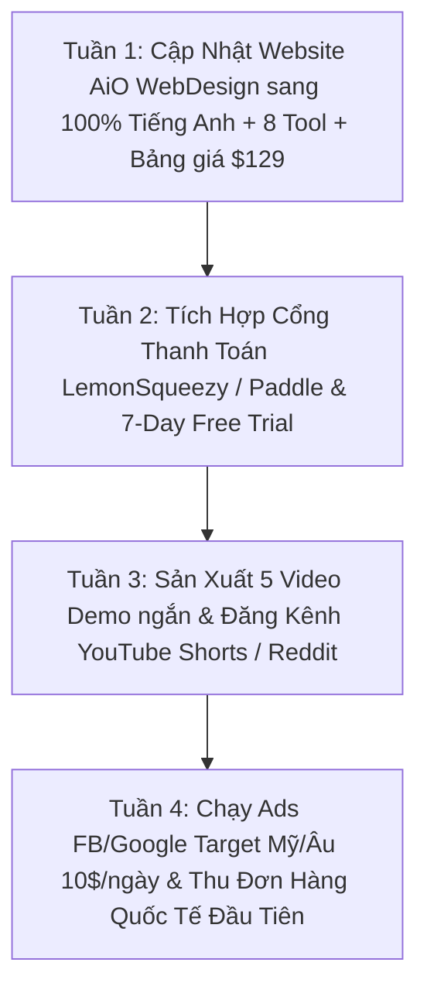

# AIO STUDIO — BÁO CÁO TỔNG HỢP NGHIÊN CỨU THỊ TRƯỜNG, ĐỐI THỦ, BẢNG GIÁ & KẾ HOẠCH MARKETING QUỐC TẾ (GLOBAL 100%)

> **Tài liệu tổng hợp dành riêng cho Anh Tiến**
> **Ngày lập:** 02/08/2026
> **Mục đích:** Cung cấp bức tranh toàn cảnh về thị trường Tool Video NLE quốc tế, phân tích đối thủ thực tế (AutoPod, AutoCut, FireCut, Web SaaS), xây dựng cấu trúc Bảng giá USD tối ưu và lộ trình Marketing từng bước để anh suy nghĩ & đưa ra quyết định chiến lược.

---

## 📌 PHẦN I: TỔNG QUAN HỆ SINH THÁI SẢN PHẨM AIO STUDIO SUITE (8 TOOLS NATIVE)

### 1. Định Hướng Sản Phẩm Cốt Lõi
- **MỘT BỘ CÀI — MỘT GIÁ — MỞ PREMIERE PRO RA CÓ ĐỦ 8 PANELS NATIVE.**
- **100% Offline & Bảo Mật:** Xử lý hoàn toàn trên máy local của Editor, không đẩy video lên Cloud Server.
- **Không Giới Hạn Quota (Unlimited):** Không bị thu phí theo số phút hay số giờ audio/video xử lý.

### 2. Số Liệu Đo Đạc Thực Tế Của 8 Tools
1. **AiO Asset Manager:** Quản lý **28.846+ Asset**, preview sóng âm/video <1s, WebP q80 nhẹ hơn 70%, chèn đúng track không đè.
2. **AiO Power Bins:** Brand Kit tự động xuất hiện ở MỌI project mới toanh mà không cần import lại.
3. **AiO Autocut:** Dò khoảng lặng tự động, loại bỏ phần thừa & dồn clip thô tại chỗ + undo 1 click.
4. **AiO Transcripts:** Speech-to-Text video 60 phút thành 765 câu thoại chỉ trong **14s**. Tự chuẩn hóa ngắt dòng chuẩn TikTok/Reels (**193 ➔ 42 ký tự**).
5. **AiO Auto Re-Frames:** Tự động chuyển sequence ngang 16:9 sang **DỌC 9:16** bám theo chủ thể chính (bọc Sensei).
6. **AiO Auto Podcast:** Dựng Podcast Multicam tự động cắt góc quay theo người phát biểu. **Chống trôi lip-sync ở video >90 phút**, chấp nhận trộn sample-rate 44.1kHz + 48kHz.
7. **AiO Auto Guideline Frame:** Bật Safe Zone 10 nền tảng (53 vùng) & lưới bố cục chuẩn xác chỉ trong **0.2s**.
8. **AiO Auto Cut Short:** Tự động phân tích & trích xuất các câu thoại/khoảnh khắc đắt giá thành clip Short-form 60s có phụ đề.

---

## 🔍 PHẦN II: BÁO CÁO NGHIÊN CỨU THỊ TRƯỜNG & PHÂN TÍCH ĐỐI THỦ CHUYÊN SÂU

### 1. Bức Tranh Thị Trường Tool Editing Quốc Tế (Global Market 2026)
Thị trường công cụ dựng video trên thế giới chia làm **2 Nhóm chính**:

#### Nhóm A: Web-Based SaaS Apps (Submagic, OpusClip, Captions.ai, CapCut Pro)
- *Quảng cáo cực rầm rộ trên Instagram / TikTok.*
- *Nhược điểm:* Bắt buộc người dùng phải Export video rồi Upload hàng Gigabyte lên Web của họ, ngồi đợi xử lý rồi mới tải về. Phụ thuộc Internet, thu phí hàng tháng ($20-$50/m) và giới hạn số phút audio.
- *Điểm yếu gãy workflow:* **Editor chuyên nghiệp và Agency cực kỳ ghét việc này.**

#### Nhóm B: Direct Native Plugins (AutoPod, AutoCut.fr, FireCut AI, PremiereCopilot)
- *Chạy trực tiếp dạng Panel trong Premiere Pro / DaVinci Resolve.*
- *Điểm yếu đối thủ:* Đa số thu phí Subscription hàng tháng ($15 - $34/tháng), khóa 1 máy khắt khe, hoặc bị trôi hình-tiếng ở video dài.

---

### 2. Ma Trận So Sánh Trực Diện Giữa AiO Studio & Các Đối Thủ Lớn

| Tiêu chí | **AutoPod.fm** | **AutoCut.fr** | **FireCut AI** | **Submagic (Web)** | **AiO Studio Suite** |
| :--- | :--- | :--- | :--- | :--- | :--- |
| **Giá Tháng** | $29.00 / tháng | $14.90 / tháng | $24 – $34 / tháng | $20 – $50 / tháng | **$14.90 / tháng** |
| **Giá Năm** | $228 / năm | $178 / năm | ~$240 / năm | ~$240 / năm | **$69 / năm** *(Rẻ hơn 70%)* |
| **Gói Vĩnh Viễn (Lifetime)** | ❌ Không có | ❌ Không có | ❌ Không có | ❌ Không có | **$129 Mua 1 Lần Dùng Cả Đời** |
| **Môi Trường** | Native Panel | Native Panel | Native Panel | Web Browser | **Native Panel trong Premiere** |
| **Bảo Mật** | Cần Server | Cần Cloud | Phụ thuộc Cloud | Cần Upload Video | **100% OFFLINE trên máy Editor** |
| **Giới Hạn Quota**| Không | Không | Giới hạn hours AI | Giới hạn credits | **KHÔNG GIỚI HẠN (Unlimited)** |
| **Xử Lý Tập Dài** | Dễ lệch >45m | Trung bình | Khá | Kém | **Chống trôi tiếng video >90m** |
| **Số Lượng Tool** | 3 tools | 1 - 2 tools | 1 tool | 1 tool Web | **TRỌN BỘ 8 NATIVE TOOLS** |

---

## 💵 PHẦN III: PHÂN TÍCH VÀ ĐỀ XUẤT ĐỊNH GIÁ QUỐC TẾ (GLOBAL PRICING)

Mục tiêu: **100% Thị Trường Quốc Tế (Mỹ, Canada, Châu Âu, Úc, Nhật, Hàn, Singapore...)**. Ẩn hoàn toàn tệp Việt Nam.

### Cấu Trúc Bảng Giá Khuyên Dùng (USD Only):

```
┌────────────────────────────────────────────────────────────────────────────────────────┐
│                        GLOBAL ONLY PRICING MATRIX (USD CURRENCY)                       │
├──────────────────────────────┬──────────────────────────┬──────────────────────────────┤
│ 🌟 STARTER MONTHLY           │ 🚀 ANNUAL PRO PASS       │ 👑 LIFETIME SUITE PASS       │
│    (Chạy Thử Trải Nghiệm)    │    (GIÁ TỐT NHẤT - 60% OFF)│    (BÁN CHẠY NHẤT)           │
├──────────────────────────────┼──────────────────────────┼──────────────────────────────┤
│  $14.90 / tháng              │  $69 / năm               │  $129 mua 1 lần              │
│                              │  (~ $5.75 / tháng)       │  (Pay Once, Lifetime Access) │
├──────────────────────────────┼──────────────────────────┼──────────────────────────────┤
│ • Full 8 Native Tools        │ • Full 8 Native Tools    │ • Full 8 Native Tools        │
│ • 1 Máy Active               │ • 1 Máy Active           │ • 1 Máy Active               │
│ • Hủy bất kỳ lúc nào         │ • Cập nhật 1 năm         │ • CẬP NHẬT TRỌN ĐỜI          │
│ • Support Discord            │ • Support Ưu Tiên 24/7    │ • VIP Support 1-1            │
└──────────────────────────────┴──────────────────────────┴──────────────────────────────┘
```

### Lý Do Lựa Chọn Mức Giá $129 Lifetime & $69/Năm:
1. **Giá $129 (Lifetime Pass):** Bằng đúng tiền thuê **4 tháng AutoPod ($29/m x 4 = $116)**. Khách quốc tế sẽ thấy việc mua trọn đời 8 tool với $129 là một deal "quá hời".
2. **Giá $69/Năm (~$5.75/tháng):** Thấp hơn cả 1 ly cà phê ở Mỹ. Giúp đẩy 70% khách chọn gói Năm thay vì gói Tháng.
3. **Độ Tin Cậy Thương Hiệu:** Với người dùng Tây, sản phẩm có 8 Tool Native chuyên nghiệp nếu bán dưới $50 vĩnh viễn sẽ bị nghi ngờ là phần mềm kém chất lượng hoặc chứa malware. Mức **$129** khẳng định giá trị đẳng cấp của sản phẩm.

---

## 📢 PHẦN IV: KẾ HOẠCH MARKETING - ADS - SALES STEP-BY-STEP DÀNH CHO NON-MARKETER

### 1. Thông Điệp Cảm Xúc Cốt Lõi (Global Campaign Hook)
> **"Edit Like You're In Flow State. Never Lose Your Creative Spark To Repetitive Clicks."**
> *(Dựng phim đúng nhịp thăng hoa. Đừng bao giờ để ngọn lửa sáng tạo bị dập tắt bởi những cú click chuột lặp đi lặp lại.)*

### 2. Kịch Bản 3 Video Ads Đỉnh Cao Trên Instagram / TikTok / Facebook:
- **Hook 1 (Cắt khoảng lặng):** Editor ức chế vì phải export file 5GB upload lên Web lấy phụ đề ➔ Bấm Auto Cut trong AiO Studio 1s xong ngay trên Premiere.
- **Hook 2 (So sánh giá):** Hóa đơn AutoPod $29/tháng ($348/năm) bị gạch ➔ Hiện AiO Studio $129 Mua 1 lần dùng mãi mãi.
- **Hook 3 (Offline 100%):** Rút dây mạng LAN/Tắt Wifi ➔ Bấm Auto Cut & Transcripts vẫn chạy cực mượt ➔ Bảo mật dữ liệu 100%.

### 3. Cấu Hình Quảng Cáo Đơn Giản ($10 - $20/ngày):
- **Location Target:** Mỹ (US), Canada (CA), Anh (UK), Úc (AU), Đức (DE), Nhật Bản (JP).
- **Exclude:** Vietnam (Loại trừ toàn bộ lãnh thổ Việt Nam).
- **Target Interests:** *Adobe Premiere Pro*, *DaVinci Resolve*, *Filmmaking*, *Post-production*, *YouTuber*.

### 4. Hạ Tầng Thanh Toán & Tự Động Bán Hàng:
- **Cổng thanh toán:** Tích hợp **LemonSqueezy** hoặc **Paddle** (Nhận Visa/Mastercard/PayPal, tự lo thuế VAT/Sales Tax toàn cầu).
- **Free Trial System:** Khách để lại Email ➔ Nhận Key dùng thử 7 ngày (Free 100%) ➔ Chuỗi 3 Email tự động gửi tiếng Anh nuôi dưỡng chốt đơn $129.

---

## 🗓️ PHẦN V: LỘ TRÌNH THỰC THI 4 TUẦN (ACTIONABLE ROADMAP)



### 💵 Dự Báo Doanh Thu 100 Khách Hàng Quốc Tế Đầu Tiên:
- 80 khách mua **Lifetime Pass ($129)** = **$10,320 (~ 260.000.000 VNĐ)**.
- 20 khách mua **Annual Pass ($69)** = **$1,380 (~ 35.000.000 VNĐ)**.
- **TỔNG DOANH THU:** **$11,700 (~ 295.000.000 VNĐ)**.
